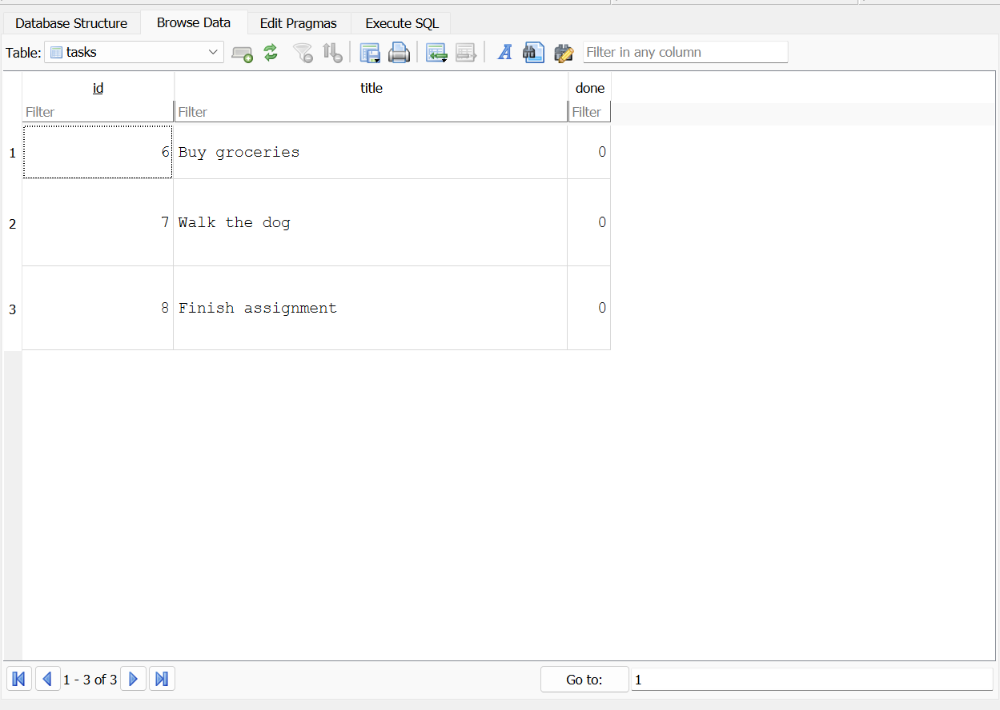

markdown
# Task API

A simple to-do list CRUD API built with Node.js and Express, as part of the FlyRank Internship Backend Track. Started as an in-memory API (Week 2, A1), moved to SQLite (Week 3, A2), and now runs on a containerized PostgreSQL database (Week 1, A3).

## What this is

A REST API that manages a to-do list — create, read, update, and delete tasks. Data lives in a PostgreSQL database running in Docker, so it survives restarts and runs identically on any machine.

## How to run it

1. Clone this repo
2. Copy the example env file:
cp .env.example .env

3. Start the whole stack (app + database) with one command:

docker compose up

4. The server runs at `http://localhost:3000`

That's it — no local Postgres install needed. The database container starts automatically, the `tasks` table is created if missing, and three example tasks are seeded on first run.

## Environment variables

Set in `.env` (see `.env.example` for the required keys):

| Variable | Description |
|---|---|
| `DATABASE_URL` | Postgres connection string, e.g. `postgres://postgres:dev@db:5432/tasks` |

## Endpoints

| Method | Path         | Description              |
|--------|--------------|---------------------------|
| GET    | /            | API info                  |
| GET    | /health      | Health check               |
| GET    | /tasks       | List all tasks             |
| GET    | /tasks/:id   | Get a single task          |
| POST   | /tasks       | Create a new task          |
| PUT    | /tasks/:id   | Update a task               |
| DELETE | /tasks/:id   | Delete a task                |

## Example request

curl -i http://localhost:3000/tasks/999

HTTP/1.1 404 Not Found
Content-Type: application/json; charset=utf-8

{"error":"Task not found"}


## Swagger UI

Interactive API docs are available at `http://localhost:3000/docs` once the server is running.


## Database

This project uses **PostgreSQL**, running in its own Docker container, replacing the SQLite file used in A2.

- **Why Postgres:** it's the same kind of database engine that powers real production backends (FlyRank included), rather than a single local file.
- **Where it lives:** inside the `db` container, with a named Docker volume (`taskdata`) so data survives container restarts and `docker compose down`/`up` cycles.
- **Note on the volume path:** this project uses Postgres 18, which changed its expected data directory structure — the volume is mounted at `/var/lib/postgresql` instead of the older `/var/lib/postgresql/data`.
- **Run it:**

cp .env.example .env
docker compose up

- **Example query** (run via `docker exec -it todo-api-db-1 psql -U postgres -d tasks`):
```sql
SELECT * FROM tasks;
```


