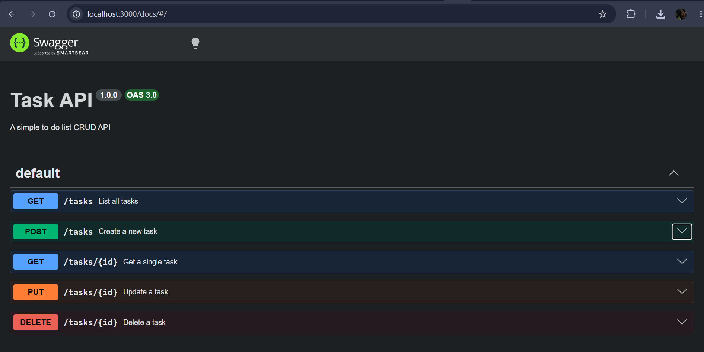

# Task API

A simple to-do list CRUD API built with Node.js and Express, as part of the FlyRank Internship Backend Track (Week 2, Assignment A1).

## What this is

A REST API that manages a to-do list — create, read, update, and delete tasks. Data is stored in memory (no database yet), so it resets when the server restarts.

## How to run it

1. Clone this repo
2. Install dependencies:
npm install

3. Start the server:

node index.js

4. The server runs at `http://localhost:3000`

## Endpoints

| Method | Path         | Description              |
|--------|--------------|---------------------------|
| GET    | /            | API info                  |
| GET    | /health      | Health check               |
| GET    | /tasks       | List all tasks             |
| GET    | /tasks/:id   | Get a single task          |
| POST   | /tasks       | Create a new task          |
| PUT    | /tasks/:id   | Update a task               |
| DELETE | /tasks/:id   | Delete a task                |

## Example request

\`\`\`
curl -i http://localhost:3000/tasks
\`\`\`

(paste your actual curl -i output here, from any of the commands you ran earlier)

## Swagger UI

Interactive API docs are available at `http://localhost:3000/docs` once the server is running.

